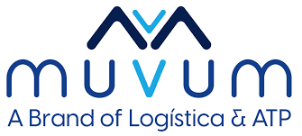
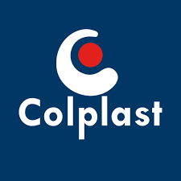

## BriteCore
- *Full Stack Developer* | Sep'22 - Present
- 
- Tags: Full Stack Developer, All, AI, Backend Developer
- Badges:
  - Python [green]
  - _Pandas [green]
  - _NumPy [green]
  - _Scikit-learn [green]
  - _ApiRest [green]
  - AWS [orange]  
  - _CloudFormation [orange]
  - _StepFunctions [orange]
  - _Lambda [orange]
  - _S3 [orange]
  - _RDS [orange]
  - Javascript [red]
  - _HTML [red]
  - _CSS [red]
  - MySQL [yellow]
  - Docker [blue]
  - GitHub [purple]
- List Items:
  - Crafted and implemented bespoke features tailored to precise client specifications using AWS, Python, and SQL.
  - Achieved a 4% reduction in data storage costs through the application of sophisticated search algorithm techniques in AWS.
  - Utilized extensive frontend technologies to orchestrate the development of custom reports, precisely aligning with individual client needs.
  - Leveraged AI techniques to analyze and predict incoming feature requests related to insurance, enhancing the efficiency and relevance of new feature development.

## Cerence
- *NLU Language Consultant* | Apr'22 - Aug'23
- 
- Tags: All, AI
- Badges:
  - Python [green]
  - _NLK [green]
  - _Pandas [green]
  - _NumPy [green]
  - _Scikit-learn [green]
  - GitHub [purple]
- List Items:
  - Implemented diverse NLP algorithms employing varied analytical methodologies, consistently achieving accuracy levels exceeding 72%. Conducted meticulous algorithm fine-tuning and optimized code for enhanced performance.
  - Utilized Python and NLU techniques to maintain model accuracy and efficiency.

## Squaretrade
- *Python Senior Developer* | Mar'22 - Oct'22
- 
- Tags: All, Backend Developer
- Badges:
  - Python [green]
  - _NLK [green]
  - _Pandas [green]
  - _NumPy [green]
  - _Scikit-learn [green]
  - MySQL [yellow]
  - Docker [blue]
  - GitHub [purple]
- List Items:
  - Implemented diverse NLP algorithms employing varied analytical methodologies, consistently achieving accuracy levels exceeding 72%. Conducted meticulous algorithm fine-tuning and optimized code for enhanced performance.
  - Utilized Python and NLU techniques to maintain model accuracy and efficiency.

## SofwareOne
- *Python/ML Developer* | Apr'2021 - Mar'22
- 
- Tags: All, Backend Developer, AI
- Badges:
  - Python [green]
  - _Pandas [green]
  - _NumPy [green]
  - _Scikit-learn [green]
  - _FastApi [green]
  - MongoBD [light-green]
  - AWS [orange]  
  - _StepFunctions [orange]
  - _Lambda [orange]
  - _S3 [orange]
  - _RDS [orange]
  - Javascript [red]
  - GitHub [purple]
- List Items:
  - Developed three key machine learning algorithms to enhance regional client operations:
  - Model Prices - Determines the optimal material price for products in specific zones.
  - Model Promotions - Identifies the most effective promotional strategies.
  - Model Negotiations - Pinpoints the best negotiation tactics for clients.

## MUVUM
- *Jr Developer* | Apr'19 - Mar'21
- 
- Tags: All, Backend Developer
- Badges:
  - Python [green]
  - _Pandas [green]
  - _NumPy [green]
  - _Scikit-learn [green]
  - _FastApi [green]
  - AWS [orange]  
  - _StepFunctions [orange]
  - _Lambda [orange]
  - _S3 [orange]
  - _RDS [orange]
  - MySQL [yellow]
  - Docker [blue]
  - GitHub [purple]
- List Items:
  - Developed machine learning models to predict product demand and optimize picking times, significantly enhancing
  warehouse processes. The time taken for these tasks has been reduced from 12 hours to just 2 hours, demonstrating a
  remarkable 80% increase in efficiency.

## Colplast S.A.S
- *Coordinator of Application Enginnering* | Jan'18 - Mar'19
- 
- Tags: All
- Badges:
  - Python [green]
  - MySQL [yellow]
  - GitHub [purple]
- List Items:
  - Collaborated with technicians and engineers to define project scopes, outlining necessary activities and resources essential
for successful completion. Managed the budget meticulously on a monthly basis, implementing on-premise Python solutions
to various projects and successfully reducing costs by 5%.
