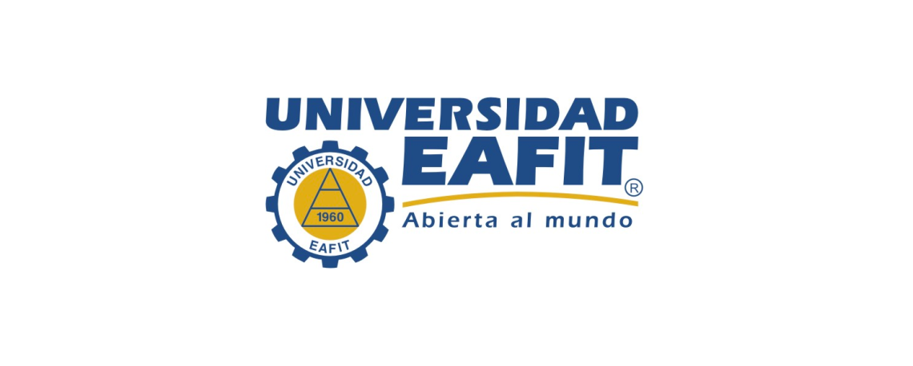

## ARTIFICIAL INTELLIGENCE & MACHINE LEARNING 
I am currently pursuing a specialization in Artificial Intelligence and Machine Learning. This program provides in-depth knowledge of AI concepts and machine learning algorithms. I am gaining hands-on experience in designing, implementing, and optimizing machine learning models, working extensively with popular libraries and frameworks such as TensorFlow, Keras, and PyTorch. Additionally, I am developing skills in natural language processing, computer vision, and reinforcement learning. This specialization is equipping me with the expertise to create intelligent systems and innovative AI solutions for complex problems.
- 
- Tags: AI
- Badges:
  - Python [green]
  - _NLK [green]
  - _Pandas [green]
  - _NumPy [green]
  - _Scikit-learn [green]
  - GitHub [purple]
- Buttons:
  - Link [https://www.lambtoncollege.ca/programs/international/aimt]

## SPECIALIZATION IN ANALYTICS AND DATA SCIENCE
I completed a 2-year Specialization in Analytics and Data Science program, where I learned the fundamentals of data science and developed a strong foundation in mathematics. Throughout the program, I completed several projects that involved data cleaning, exploratory data analysis, and predictive modeling. I became proficient in using essential Python libraries such as NumPy, Pandas, Matplotlib, Seaborn, Scikit-Learn, TensorFlow, and Keras. This program equipped me with the skills to analyze data, derive insights, and create data-driven solutions.
- 
- Tags: Engineering, AI
- Badges:
  - Python [green]
  - _NLK [green]
  - _Pandas [green]
  - _NumPy [green]
  - _Scikit-learn [green]
  - Management [blue]
- Buttons:
  - Link [https://www.udea.edu.co/wps/portal/udea/web/inicio/unidades-academicas/ingenieria/estudiar-facultad/posgrados/especializacion-analitica-ciencia-datos]

## BACHELOR’S DEGREE IN ENGINEERING
I completed a 5-year Bachelor's Degree in Engineering program, where I learned the fundamentals of engineering and developed a strong foundation in mathematics, physics, computer science, and management in engineering.
- 
- Tags: Engineering
- Badges:
  - Python [green]
  - Management [blue]
- Buttons:
  - Link [https://www.eafit.edu.co/pregrado-ingenieria-mecanica]